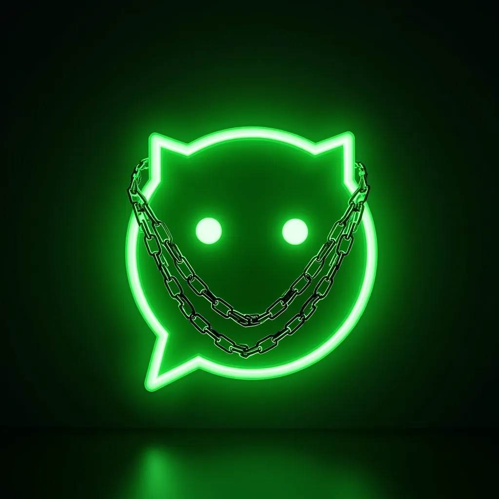
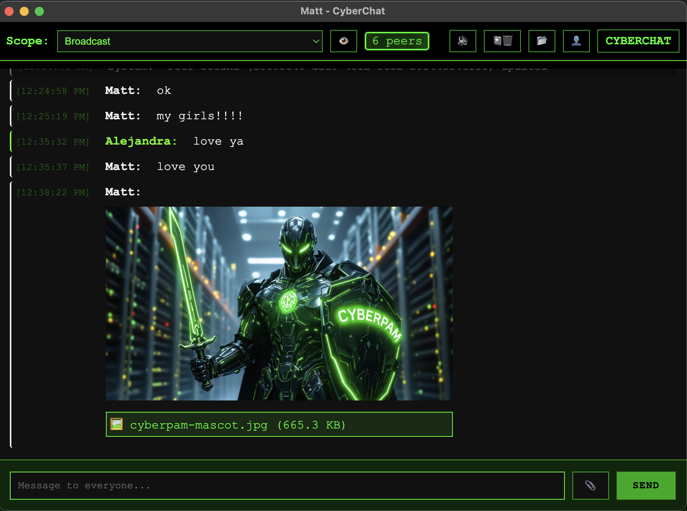
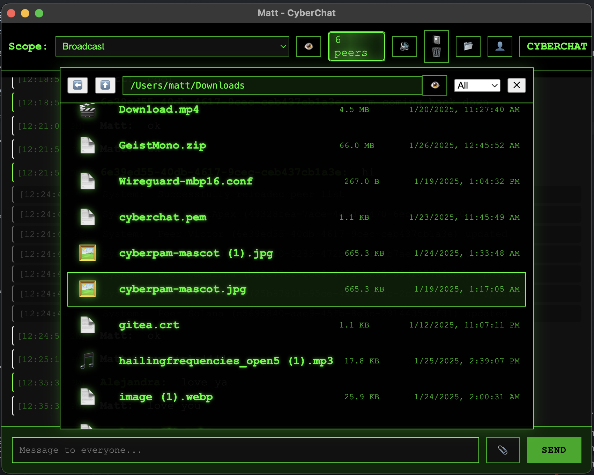
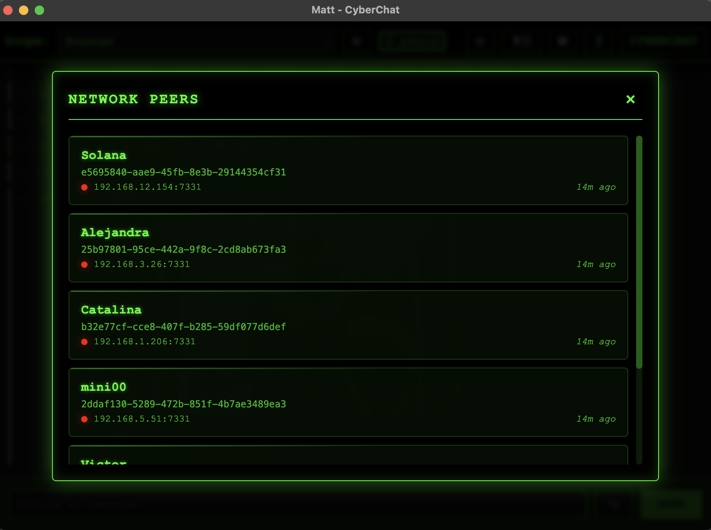

# CyberChat 🌐

[](https://golang.org)
[](LICENSE)
[](https://github.com/ramborogers/cyberchat/releases)
[](https://github.com/ramborogers/cyberchat#-key-features)


A secure, peer-to-peer chat application with end-to-end encryption, featuring a cyberpunk-themed UI and zero-configuration networking.  Think [Localsend](https://localsend.org) but with chat and broadcast capabilities.

### When you would use cyberchat:
 - You want instant communication with friends/family without configuring anything
 - You want to talk to Linux / Windows / Mac machines without configuring anything
 - You want to share files with friends without the internet
 - You want to chat with friends without the internet

### CyberChat Screenshots

<div align="center">
<table>
<tr>
<td></td>
<td></td>
</tr>
<tr>
<td></td>
<td></td>
</tr>
</table>
</div>

## ✨ Key Features

<div align="center">
<table>
  <tr>
    <td>
      <strong>🔒 Security</strong><br>
      • End-to-end encryption<br>
      • Perfect forward secrecy<br>
      • Certificate-based security<br>
      • 1 click wipe<br>
      • No internet required
    </td>
    <td>
      <strong>🌐 Networking</strong><br>
      • Zero configuration<br>
      • Peer-to-peer via mDNS<br>
      • Direct message routing<br>
      • No central server<br>
      • Offline support
    </td>
    <td>
      <strong>📱 Interface</strong><br>
      • Desktop app<br>
      • Web interface<br>
      • Cyberpunk theme<br>
      • Real-time updates<br>
    </td>
  </tr>
  <tr>
    <td>
      <strong>📁 Files</strong><br>
      • Encrypted transfers<br>
      • Unlimited file size<br>
      • Media previews<br>
      • Auto cleanup<br>
      • Resume support
    </td>
    <td>
      <strong>📢 Social</strong><br>
      • Broadcast messages<br>
      • Private messages<br>
    </td>
    <td>
      <strong>⚡ Performance</strong><br>
      • Low resource usage<br>
      • Quick startup<br>
      • State recovery
    </td>
  </tr>
</table>
</div>

## ⚡ Installation

The binary is available for Windows, Mac, and Linux. You can download from the bins folder, or use the install scripts. They are in the repo if you want to browse the commands (super simple download and copy).

---

### 🐧 Mac & Linux & Windows (Desktop App)

For a desktop app, download a release from the [releases page](https://github.com/RamboRogers/cyberchat/releases).

<b>🍏 Homebrew Install for Apple Desktop App</b>

```
brew tap ramborogers/cyberchat
brew install --cask cyberchat-desktop
```
> <i>Apple doesn't like self signed apps. I've applied for a developer account, but it takes a while to get approved. Use brew to install the desktop app or you can use xattr to remove the quarantine attribute.</i>

---

### 🐧 Mac & Linux & Windows (Single Binary + Web Interface)

For a single binary, you can use the install scripts and your web browser.

Open a terminal and run the following command:

```bash
curl -L https://raw.githubusercontent.com/RamboRogers/cyberchat/refs/heads/master/install.sh | sh
```

or Brew for Mac

```bash
brew tap ramborogers/cyberchat
brew install cyberchat
```

### 🪟 Windows PowerShell

Open a PowerShell terminal and run the following command:
```powershell
iwr -useb https://raw.githubusercontent.com/RamboRogers/cyberchat/refs/heads/master/install.ps1 | iex
```

## 🚀 Quick Start

The cyberchat binary has a number of options. You can run the server directly, or run the desktop electron app.
```bash
Usage of cyberchat
  -d string
        Custom home directory for CyberChat data
  -debug
        Enable debug logging
  -n string
        Name to use for this peer
  -p int
        Port to listen on (default 7331)
  -r    Reset all data and start fresh
  -v    Show version information
```

Then access the web interface at `https://localhost:7331`

## 🔧 Prerequisites

- Go 1.22 or later
- Node.js and npm
- GCC for CGO compilation
- Platform-specific requirements:
  - **Windows**: MinGW
  - **Linux**: build-essential
  - **macOS**: Xcode CLI tools

## 🏗️ Architecture

### Security Model

- RSA key pairs for peer identity
- AES-256 message encryption
- Trust levels (0-4) for peers
- Certificate-based transport security

### Core Components

- **Server** (Default port: 7331)
  - SQLite persistence
  - Gorilla Mux routing
  - WebSocket support
  - Auto-port increment

- **Database Schema**
  ```
  settings  - Configuration
  peers     - Network members
  messages  - 30-day retention
  files     - Transfer tracking
  relays    - Message routing
  ```

- **API Endpoints**
  ```
  /api/v1/message    - Message handling
  /api/v1/file       - File operations
  /api/v1/whoami     - Identity management
  /api/v1/discovery  - Peer discovery
  /api/v1/client     - Web client API
  ```

## 🤝 Contributing

1. Fork the repository
2. Create a feature branch (`git checkout -b feature/amazing-feature`)
3. Commit your changes (`git commit -m 'Add amazing feature'`)
4. Push to the branch (`git push origin feature/amazing-feature`)
5. Open a Pull Request

## 📝 License

This project is licensed under the GNU GPL v3.0 License - see the [LICENSE](LICENSE) file for details.

## 🛡️ Security

Please report security vulnerabilities to the issue tracker.

## 🙏 Acknowledgments

- The Go team for an amazing language
- The Electron project for cross-platform support
- The cyberpunk community for design inspiration

---

<div align="center">

## ⚖️ License

<p>
CyberDock is licensed under the GNU General Public License v3.0 (GPLv3).<br>
<em>Free Software</em>
</p>

[](https://www.gnu.org/licenses/gpl-3.0)

### Connect With Me 🤝

[](https://github.com/RamboRogers)
[](https://x.com/rogerscissp)
[](https://matthewrogers.org)

</div>